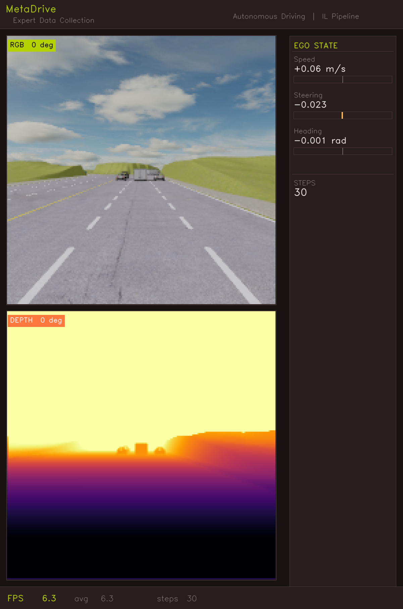

# VisHybrid-X

> Autonomous driving via **Behavioral Cloning + PPO fine-tuning** in the [MetaDrive](https://github.com/metadriverse/metadrive) simulator.
> An expert collects demonstrations → a CNN policy learns to imitate → PPO fine-tunes it with environment rewards.



---

## Highlights

- **IMPALA-style residual CNN** with dual steering/throttle heads and no BatchNorm (safe at batch_size=1 during RL rollouts)
- **Depth Anything V2** fine-tuned on MetaDrive frames with Scale-Shift Invariant Loss, precomputed and cached so policy training is 5–10× faster
- **Curriculum lane masking** — training starts with only lane markings visible (α=0), then gradually blends in full RGB to prevent over-reliance on colour cues
- **Asymmetric braking loss** — 3× penalty on missed braking events counteracts class imbalance without rule-based hacks
- **IL → RL handoff** — `ILActorCritic` wraps the IL backbone and adds a PPO value head; IL-learned weights are preserved, only the critic and action std are new
- **Observation pipeline verification** — `verify_simulation.py` confirms the RL env sees the same depth/normalisation as IL training

---

## Architecture

### Policy Networks

Three architectures, selected with `--arch`:

| `--arch` | Network | Description |
|---|---|---|
| `simple` | `DrivingPolicyNet` | 3-layer CNN (8×8/4 → 4×4/2 → 3×3/1), single fusion head |
| `impala` | `ImpalaNet` | IMPALA residual CNN, 3 MaxPool stages (32→64→64 ch), dual output heads |
| `impala_v2` | `ImpalaNetV2` | Wider (48→96→96 ch), SE channel attention, deeper vis_proj, ImageNet-normalised RGB |

All networks accept a **4-channel input** (depth + RGB) at `image_size × image_size`, fuse a 512-d visual feature with a 32-d ego-state feature, and output `[steering, accel/brake]` ∈ [-1, 1].

**Ego state (EGO_DIM=3):** `[total_speed, last_steer, heading_delta]`

### IL → RL Actor-Critic

```
IL backbone (ImpalaNet)
    visual CNN  →  512-d  ┐
    ego MLP     →   32-d  ┘  concat → 544-d merged feature
                                ├── steer_head  → steering  (IL weights, fine-tuned)
                                ├── accel_head  → throttle  (IL weights, fine-tuned)
                                ├── log_std     → action std (new, learnable)
                                └── value_head  → V(s)       (new, random init)
```

---

## Results

Offline metrics on a held-out test split after 30 epochs of IL training (`impala`, 84×84):

| Metric | Value |
|---|---|
| Steering MAE | 0.048 |
| Steering direction accuracy | 92.3% |
| Braking accuracy | 88.7% |
| Steering Pearson correlation | 0.941 |
| Active-turn MAE (`\|steer\| > 0.05`) | 0.063 |
| Jitter ratio (1.0 = expert smoothness) | 1.12 |

Live simulation: IL baseline achieves **30–60% route completion**. PPO fine-tuning aims to improve this.

---

## Installation

```bash
# 1. Create environment
conda create -n metadrive-auto python=3.11 -y
conda activate metadrive-auto

# 2. Install PyTorch (adjust for your CUDA version: cu118, cu121, etc.)
pip install torch torchvision torchaudio --index-url https://download.pytorch.org/whl/cu121

# 3. Install project requirements
pip install -r requirements.txt

# 4. Clone Depth-Anything-V2 (or use the submodule)
git clone https://github.com/DepthAnything/Depth-Anything-V2
cd Depth-Anything-V2 && pip install -r requirements.txt && cd ..
```

For Google Colab: `pip install -r requirements_colab.txt`

Download the Depth-Anything-V2 checkpoint (`depth_anything_v2_vits.pth`) from the [official repo](https://github.com/DepthAnything/Depth-Anything-V2) and place it in `Depth-Anything-V2/checkpoints/`.

**Sanity check:**
```bash
python -c "import metadrive; import torch; print('OK', torch.cuda.is_available())"
python -c "import sys; sys.path.insert(0,'src'); from models import build_policy; m=build_policy('impala',84); print('model OK', sum(p.numel() for p in m.parameters()), 'params')"
```

---

## Quick Start

The fastest path to a working agent (~2 h on a modern GPU):

```bash
# 1. Collect 50 expert episodes (~20 min)
python src/generate_expert_dataset.py --episodes 50 --num_workers 4

# 2. Precompute depth cache (~10 min on GPU)
python src/train_dpt.py --mode precompute --data_dir dataset --out_dir data/processed/dpt_pred

# 3. Train IL policy for 20 epochs (~30–60 min)
python src/train_test_policy.py --mode train --epochs 20 \
    --pred_dir data/processed/dpt_pred \
    --model_path models/policy_model.pth --arch impala --image_size 84

# 4. Watch it drive
python src/test_simulation_policy.py \
    --model_path models/policy_model_best.pth --arch impala --image_size 84

# 5. RL fine-tune for 500K steps (~4–6 h)
cd Autonomous-Driving-RL
python train_rl.py --il_checkpoint ../models/policy_model_best.pth \
    --arch impala --image_size 84 --timesteps 500000
```

---

## Full Pipeline

### Directory layout

```
Metadrive Autonomous/
├── src/
├── models/                    ← checkpoints go here
├── dataset/                   ← expert data (created in step 1)
├── data/processed/dpt_pred/   ← depth cache (created in step 3)
├── Depth-Anything-V2/
│   └── checkpoints/
│       └── depth_anything_v2_vits.pth
└── Autonomous-Driving-RL/
    └── models/rl/             ← RL checkpoints
```

---

### Step 1 — Collect Expert Data

```bash
python src/generate_expert_dataset.py --episodes 100 --num_workers 4
# With GPU camera processing (faster):
python src/generate_expert_dataset.py --episodes 100 --image_on_cuda --num_workers 4
```

Parallel workers drive MetaDrive with the built-in expert policy. Each episode takes 5–30 s. Output: `dataset/train/`, `val/`, `test/` as `.npz` files. 100 episodes ≈ 50–80k frames. Minimum for a smoke-test: 30 episodes.

---

### Step 2 — Fine-tune Depth Model (Optional)

```bash
python src/train_dpt.py --mode train --epochs 5 \
    --data_dir dataset --model_path models/dpt_finetuned.pth
```

MetaDrive's synthetic frames shift the depth scale and contrast relative to real-world data. Fine-tuning with Scale-Shift Invariant Loss adapts the model. Skip this to move fast — the base weights still work.

---

### Step 3 — Precompute Depth (Required)

```bash
# With fine-tuned weights:
python src/train_dpt.py --mode precompute \
    --model_path models/dpt_finetuned.pth \
    --data_dir dataset --out_dir data/processed/dpt_pred

# Without fine-tuning:
python src/train_dpt.py --mode precompute \
    --data_dir dataset --out_dir data/processed/dpt_pred
```

Runs DPT once on every frame and caches the result. Takes 10–30 min on GPU. Policy training will be 5–10× faster because it skips live DPT inference.

---

### Step 4 — Train the IL Policy

```bash
python src/train_test_policy.py --mode train --epochs 30 \
    --pred_dir data/processed/dpt_pred \
    --model_path models/policy_model.pth \
    --arch impala --image_size 84
```

**What to watch:**
```
Epoch  5/30 | train_loss: 0.142 | val_loss: 0.118 | steer_mae: 0.071 | brake_acc: 0.84
Epoch 10/30 | train_loss: 0.098 | val_loss: 0.089 | steer_mae: 0.054 | brake_acc: 0.91
```
- `steer_mae` < 0.08 is decent; < 0.05 is good
- `brake_acc` > 0.85 means braking is detected correctly
- If `val_loss` rises for 5+ epochs, early stopping triggers

Checkpoints: `models/policy_model_best.pth` (lowest val loss — use this).

**Fine-tune an existing checkpoint:**
```bash
python src/train_test_policy.py --mode finetune \
    --finetune_from models/policy_model_best.pth \
    --model_path models/policy_finetuned.pth \
    --pred_dir data/processed/dpt_pred \
    --epochs 10 --lr 2e-5 --freeze_backbone
```

---

### Step 5 — Offline Evaluation

```bash
python src/train_test_policy.py --mode test \
    --model_path models/policy_model_best.pth \
    --pred_dir data/processed/dpt_pred
```

Reports steering/accel MAE, direction accuracy, braking accuracy, Pearson correlation, p95 steering error, active/critical turn MAE, jitter ratio, and out-of-bounds rate. Good offline metrics don't guarantee good simulation — always do the live test too.

---

### Step 6 — Live Simulation Test (IL)

```bash
python src/test_simulation_policy.py \
    --model_path models/policy_model_best.pth \
    --dpt_path models/dpt_finetuned.pth \
    --arch impala --image_size 84 \
    --episodes 5
```

A MetaDrive window opens. A second window shows the depth map and RGB input with an ego-state HUD.

```
Episode 1 done. Reason: success     | Route: 100.0% | Avg Spd: 0.41
Episode 2 done. Reason: out_of_road | Route:  34.2% | Avg Spd: 0.38

Success Rate:      40.0%
Route Completion:  67.3%
```

A fresh IL model typically gets 30–60% route completion — enough to start RL fine-tuning.

---

### Step 7 — RL Fine-tuning (IL → RL)

```bash
cd Autonomous-Driving-RL

# Fine-tune from IL checkpoint (recommended)
python train_rl.py \
    --il_checkpoint ../models/policy_model_best.pth \
    --arch impala --image_size 84 \
    --timesteps 1000000

# With 4 parallel envs (faster)
python train_rl.py \
    --il_checkpoint ../models/policy_model_best.pth \
    --arch impala --image_size 84 --n_envs 4 \
    --timesteps 1000000

# Resume a previous run
python train_rl.py \
    --rl_checkpoint models/rl/policy_latest.pth \
    --arch impala --image_size 84

# Watch training live (slows ~20%)
python train_rl.py --il_checkpoint ../models/policy_model_best.pth \
    --arch impala --image_size 84 --render
```

**`--arch` and `--image_size` must match IL training.**

On startup you'll see:
```
[IL→RL] Loading full IL checkpoint (epoch=29, val_loss=0.0412)
[IL→RL] Matched 18/18 parameter tensors.
[IL→RL] Missing (randomly init'd): value_head, log_std  ← expected
```

**What to watch:**
```
EP   1 | R:  +2.14 | Len:  143 | Route: 28.1% | Spd: 31.2
EP   2 | R:  -8.43 | Len:   18 | Route:  3.8% | out_of_road: -10.00

Update 1 | Step 2,048/1,000,000 | FPS: 780 | Avg R(20): +1.2 | Avg Route: 18.3% | Entropy: 1.34
```
- **Avg Route** is the primary metric; it should trend upward
- **Entropy** staying above ~0.5 means the policy is still exploring
- Early crashes are normal

**Time guide:**

| Timesteps | GPU estimate | What to expect |
|---|---|---|
| 50K | ~30 min | Verify nothing crashes |
| 200K | ~2 h | Basic behaviour visible |
| 1M | ~8–12 h | Policy stabilising, route% higher than IL baseline |

---

### Step 8 — Test the RL Policy

```bash
# Quick test in the RL environment
python test_rl.py --checkpoint models/rl/policy_best.pth --arch impala --scenarios 10

# Full simulation test (same HUD as IL)
python ../src/test_simulation_policy.py \
    --model_path models/rl/policy_best.pth \
    --arch impala --image_size 84 --episodes 5
```

`test_simulation_policy.py` auto-detects RL checkpoints:
```
[INFO] RL checkpoint detected — extracted 18 IL backbone tensors.
```

---

## Key Arguments

### IL Training (`src/train_test_policy.py`)

| Argument | Default | Description |
|---|---|---|
| `--arch` | — | `simple`, `impala`, or `impala_v2` |
| `--image_size` | `84` | Input resolution |
| `--pred_dir` | — | Path to precomputed depth cache |
| `--fully_masked_epochs` | — | Epochs with lane-only input before curriculum starts |
| `--curriculum_epochs` | — | Epochs to blend from lane-only to full RGB |
| `--freeze_backbone` | off | Freeze CNN during fine-tuning |

### RL Training (`Autonomous-Driving-RL/train_rl.py`)

| Argument | Default | Description |
|---|---|---|
| `--il_checkpoint` | `None` | IL model to start from |
| `--rl_checkpoint` | `None` | Previous RL checkpoint to resume |
| `--arch` | `impala` | Must match IL training |
| `--image_size` | `84` | Must match IL training |
| `--timesteps` | `200000` | Total env steps (1M+ recommended) |
| `--n_envs` | `1` | Parallel env workers |
| `--rollout` | `2048` | Steps per env per PPO update |
| `--lr` | `3e-4` | LR for value head + log_std |
| `--backbone_lr` | `1e-5` | LR for IL backbone (lower to preserve features) |
| `--scenarios` | `50` | Map variety (higher = harder generalisation) |
| `--render` | off | Open MetaDrive 3D window |

---

## Reward System

| Component | Default | Notes |
|---|---|---|
| Route progress | `×100` per Δ | Primary training signal |
| Arrive destination | `+50` | Strong sparse terminal bonus |
| Out of road | `−10` | Terminal |
| Crash vehicle | `−20` | Terminal, heaviest penalty |
| Crash object | `−10` | Terminal |
| Harsh steering | `−0.1 × (\|steer\|−0.3) × speed_factor` | Only above 0.3 threshold; speed-scaled |
| Steering jerk | `−0.2 × Δsteer × speed_factor` | Discourages sudden changes |
| Speed bonus | `+0.1 × speed/40` | Per step above 5 km/h |
| Standing still | `−0.05` | Per step at or below 5 km/h |

To add a reward term: add a field to `RewardConfig` and a block in `rl/rewards.py` — nothing else changes.

---

## Project Structure

```
src/
├── generate_expert_dataset.py   # Expert data collection (parallel workers)
├── train_dpt.py                 # Depth model fine-tuning + precomputation
├── train_test_policy.py         # Policy training, fine-tuning, offline test
├── test_simulation_policy.py    # Live MetaDrive test (IL + RL checkpoints)
├── models.py                    # All network definitions + ego-state utilities
├── data/
│   └── cameras.py               # Multi-camera rig configuration
├── policy/
│   ├── datasets.py              # MetaDriveRGBDataset, PrecomputedDepthDataset
│   ├── losses.py                # custom_driving_loss, offline/predictive metrics
│   └── trainer.py               # Epoch loop, lane masking, curriculum logic
└── utils/
    ├── checkpoints.py           # save/load checkpoint, freeze backbone
    └── fps.py                   # FPS measurement

Autonomous-Driving-RL/
├── train_rl.py                  # PPO training entry point
├── test_rl.py                   # Deterministic test rollout
├── verify_simulation.py         # Obs-pipeline consistency check
└── rl/
    ├── il_actor_critic.py       # ILActorCritic: IL backbone + PPO heads
    ├── env_wrapper.py           # MetaDrive env, DPT depth, ego state
    ├── vec_env.py               # SubprocVecEnv / DummyVecEnv for parallel envs
    ├── ppo.py                   # PPO algorithm + rollout buffer
    ├── rewards.py               # Modular reward/penalty system
    └── obs_verifier.py          # Record/compare obs stats across runs
```

---

## Dependencies

Core: `torch`, `torchvision`, `metadrive-simulator`, Depth-Anything-V2 (submodule), `numpy`, `scipy`.

```bash
pip install -r requirements.txt
```

For Google Colab: `pip install -r requirements_colab.txt`
